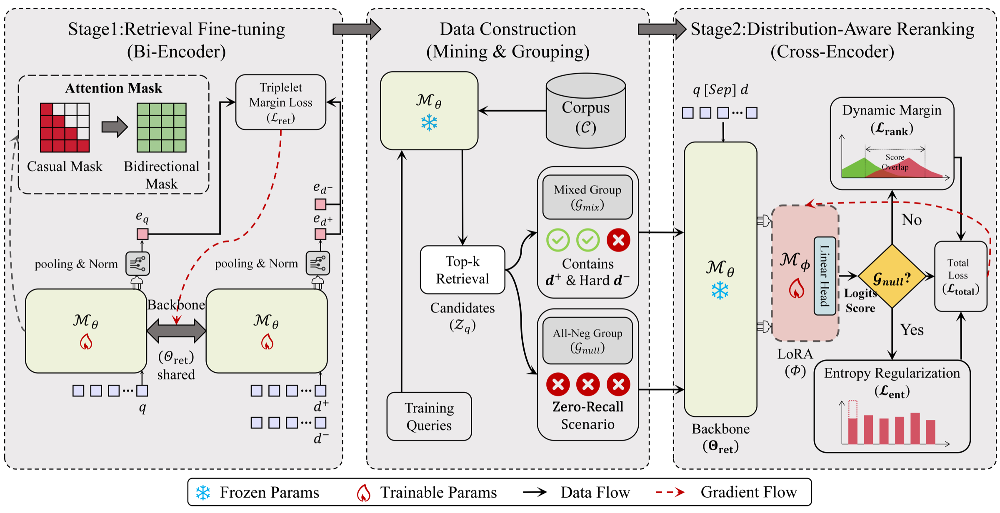

# RULER

**RULER: Robust Unified LLM-based Efficient Retrieval for Legal Information**

<p align="center">
  <a href="https://sigir.org/sigir2026/"></a>
  
  
</p>

**Language:** English | [简体中文](README.zh-CN.md)

This is the official repository for **RULER**, accepted to **SIGIR 2026**.

> **Current status.** The paper has been accepted, but the public code release is still being prepared. This repository is currently being organized for release. Code, scripts, checkpoints, and full reproduction instructions will be added progressively after cleanup and verification.

## Table of Contents

- [News](#news)
- [Overview](#overview)
- [Framework](#framework)
- [Why RULER](#why-ruler)
- [Method](#method)
- [Results](#results)
- [Datasets](#datasets)
- [Release Roadmap](#release-roadmap)
- [Planned Repository Structure](#planned-repository-structure)
- [Citation](#citation)
- [Contact](#contact)

## News

- **2026-07:** RULER will appear at SIGIR 2026 in Melbourne, Australia.
- **2026:** Paper accepted to the 49th International ACM SIGIR Conference on Research and Development in Information Retrieval.
- **Pre-release:** Repository cleanup and release preparation are in progress.

## Overview

Legal information retrieval requires both high recall and high precision. Standard retrieve-then-rerank systems usually rely on two independent models: a bi-encoder retriever for candidate generation and a cross-encoder reranker for fine-grained ranking. Although effective, this separated design introduces parameter redundancy, deployment complexity, and semantic mismatch between stages.

**RULER** addresses this issue with a unified architecture built on a single **Qwen3-0.6B** backbone. The same backbone is progressively adapted for dense retrieval and LoRA-based cross-encoder reranking, allowing the two stages to share representations while preserving the efficiency of a two-stage pipeline.

The framework is especially designed for legal retrieval scenarios where irrelevant candidates may receive over-confident scores. We refer to these high-scoring false positives as **phantom hits** and explicitly model them during reranker training.

## Framework

<p align="center">
  
</p>

RULER consists of three connected parts: Stage 1 retrieval fine-tuning, retrieval-based data construction, and Stage 2 distribution-aware reranking. The training process explicitly models both mixed positive-negative groups and all-negative zero-recall groups.

## Why RULER

- **Unified retrieval and reranking:** one LLM backbone supports both candidate generation and reranking.
- **Progressive training:** the reranker starts from the retrieval-adapted checkpoint instead of an unrelated model.
- **Robust negative modeling:** mixed groups and all-negative groups simulate both normal ranking and zero-recall scenarios.
- **Distribution-robust objective:** dynamic margin ranking and maximum entropy regularization reduce over-confidence on irrelevant candidates.
- **Legal-domain evaluation:** experiments cover JuDGE-Stat and LeCaRDv2-Stat, two Chinese legal statute retrieval benchmarks.

## Method

RULER keeps the classic retrieve-then-rerank workflow, but shares the underlying backbone across stages:

```text
Query
  -> Stage 1: Qwen3 bi-encoder retriever
  -> Dense vector search with FAISS
  -> Top-50 candidate statutes
  -> Stage 2: Qwen3 + LoRA cross-encoder reranker
  -> Final ranked statute list
```

### Stage 1: Bi-Encoder Retrieval

The retriever fine-tunes Qwen3-0.6B with last-token pooling and normalized embeddings. It generates dense representations for queries and statutes and retrieves top candidates through FAISS search.

### Stage 2: Cross-Encoder Reranking

The reranker starts from the Stage 1 checkpoint and applies LoRA-based fine-tuning. Training groups are constructed from retrieved candidates:

- **Mixed groups:** include relevant statutes and retrieval-hard negative statutes.
- **All-negative groups:** include only irrelevant candidates, simulating zero-recall retrieval outputs.

RULER combines dynamic margin ranking loss with maximum entropy regularization, encouraging sharper separation in mixed groups and calibrated uncertainty in all-negative groups.

## Results

The full experimental setup will be released with the cleaned code and reproduction scripts. The following numbers are reported in the accepted paper.

### Retrieval Results

| Dataset | MRR@100 | Recall@5 | Recall@10 |
|---|---:|---:|---:|
| JuDGE-Stat | 0.8965 | 0.6570 | 0.8150 |
| LeCaRDv2-Stat | 0.9001 | 0.6832 | 0.8350 |

### Reranking Results

| Dataset | NDCG@10 | MAP@10 | R-Prec | MRR@10 |
|---|---:|---:|---:|---:|
| JuDGE-Stat | 0.9013 | 0.8299 | 0.7672 | 0.9693 |
| LeCaRDv2-Stat | 0.8605 | 0.7653 | 0.7157 | 0.9498 |

### Robustness Against Phantom Hits

On JuDGE-Stat, RULER reduces noisy high-confidence rankings compared with representative unified baselines:

| Method | NR@R ↓ | Overlap ↓ | NDCG@10 ↑ |
|---|---:|---:|---:|
| UR2N-RandengT5 | 50.6% | 89.6% | 0.7888 |
| BGE-M3 (Finetuned) | 12.7% | 79.2% | 0.8462 |
| RULER | 9.9% | 66.7% | 0.9013 |

## Datasets

RULER is evaluated on two Chinese legal statute retrieval benchmarks:

| Dataset | Source | Queries | Description |
|---|---|---:|---|
| JuDGE-Stat | JuDGE | 2,505 | Small-sample legal statute retrieval benchmark. |
| LeCaRDv2-Stat | LeCaRDv2 | 39,833 | Refined large-scale subset designed to reduce annotation sparsity and improve structural consistency. |

The dataset page is available on Hugging Face. Data preparation scripts and detailed usage instructions will be released after cleanup and license checks. Users should also follow the usage terms of the original JuDGE and LeCaRDv2 datasets.

Hugging Face dataset page: [RULER-dataset/RULER](https://huggingface.co/datasets/RULER-dataset/RULER)

## Release Roadmap

- [x] Paper accepted to SIGIR 2026.
- [x] Initial README draft.
- [ ] Clean training and evaluation scripts.
- [ ] Organize data preprocessing pipeline.
- [ ] Add reproducible configuration files.
- [ ] Release processed dataset instructions or links.
- [ ] Release trained checkpoints when permitted.
- [ ] Add full reproduction documentation.

## Planned Repository Structure

The final release is expected to use a structure similar to:

```text
RULER/
|-- retriever/                 # Stage 1 dense retriever
|-- reranker/                  # Stage 2 LoRA reranker
|-- baselines/                 # Sparse, dense, and unified baselines
|-- scripts/                   # Training, data construction, and evaluation entrypoints
|-- configs/                   # Reproducible experiment configurations
|-- docs/                      # Dataset, reproduction, and implementation notes
|-- requirements.txt           # Python dependencies
|-- LICENSE
`-- README.md
```

This layout may change slightly during release cleanup.

## Installation

Installation commands will be added with the first code release. The expected environment is:

- Python 3.9+
- PyTorch 2.0+
- CUDA-enabled GPU for training and evaluation
- `transformers`, `accelerate`, `peft`, `faiss`, `numpy`, `pandas`, and common evaluation utilities

## Citation

If you find this work useful, please cite:

```bibtex
@inproceedings{hou2026ruler,
  title = {{RULER}: Robust Unified {LLM}-based Efficient Retrieval for Legal Information},
  author = {Chenyu Hou and Ziyang Wang and Bin Cao and Jiaxing Wang and Tianming Zhang and Tiantian Li},
  booktitle = {Proceedings of the 49th International ACM SIGIR Conference on Research and Development in Information Retrieval},
  year = {2026}
}
```

## Contact

For questions about the paper or release plan, please contact the authors through the paper correspondence information.
