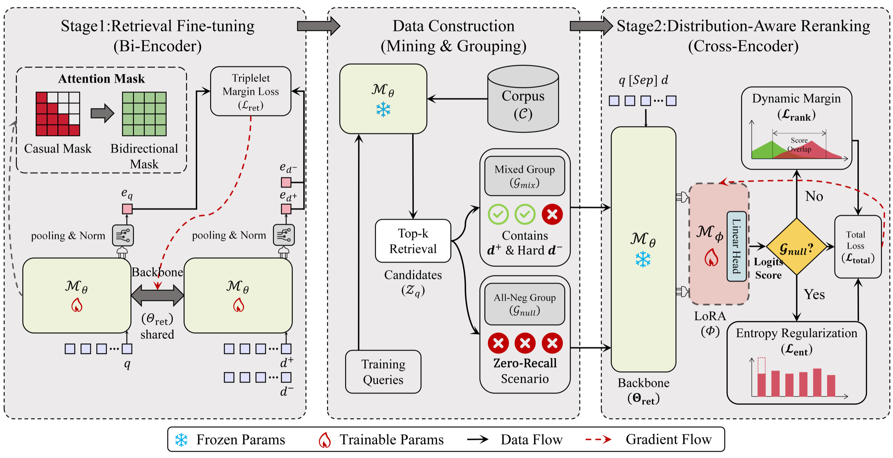

# RULER

**RULER: 面向法律信息检索的鲁棒统一式 LLM 高效检索框架**

<p align="center">
  <a href="https://sigir2026.org/"></a>
  <a href="https://doi.org/10.1145/3805712.3809698"></a>
  <a href="https://huggingface.co/datasets/RULER-dataset/RULER"></a>
  <a href="#核心入口"></a>
  <a href="https://huggingface.co/Qwen/Qwen3-0.6B"></a>
</p>

**语言：** [English](README.md) | 简体中文

本仓库是 **RULER** 的官方仓库，对应论文已正式发表于 **SIGIR 2026** 论文集。

## 目录

- [动态](#动态)
- [论文信息](#论文信息)
- [摘要](#摘要)
- [概述](#概述)
- [框架图](#框架图)
- [亮点](#亮点)
- [方法](#方法)
- [实验结果](#实验结果)
- [数据集](#数据集)
- [仓库结构](#仓库结构)
- [核心入口](#核心入口)
- [许可证](#许可证)
- [致谢](#致谢)
- [引用](#引用)
- [联系](#联系)

## 动态

- **2026-07：** RULER 已正式发表于 SIGIR 2026 论文集。
- **2026-07：** 已发布清理后的训练、数据构造和评估代码。

## 论文信息

| 项目 | 信息 |
|---|---|
| 标题 | RULER: Robust Unified LLM-based Efficient Retrieval for Legal Information |
| 作者 | Chenyu Hou, Ziyang Wang, Bin Cao, Jiaxing Wang, Tianming Zhang, Tiantian Li |
| 会议 | SIGIR 2026 |
| 时间地点 | 2026 年 7 月 20-24 日，澳大利亚墨尔本 |
| DOI | 10.1145/3805712.3809698 |
| 论文 | [ACM Digital Library](https://doi.org/10.1145/3805712.3809698) |

## 摘要

法律信息检索对精度要求很高，但传统 retrieve-then-rerank 流程通常依赖两个独立模型，容易产生级联误差传播和阶段间知识断裂。RULER 使用统一的参数共享架构，在单个 Qwen3-0.6B 主干内同时集成高效双塔检索和高精度交叉编码器重排。为缓解无关文档被赋予过高置信度的 Phantom Hits 问题，RULER 引入分布鲁棒数据构造，显式构建全负候选组，并结合动态间隔排序目标和最大熵正则化。JuDGE-Stat 和 LeCaRDv2-Stat 上的实验表明，RULER 在检索、重排和鲁棒性方面均取得了较强表现。

## 概述

法律信息检索同时要求高召回率和高精度。传统的 retrieve-then-rerank 系统通常使用两个独立模型：一个双塔检索器负责候选生成，一个交叉编码器重排器负责精细排序。这种分离式设计虽然有效，但会带来参数冗余、部署复杂度以及两个阶段之间的语义不一致问题。

**RULER** 使用统一架构解决上述问题。该框架基于单个 **Qwen3-0.6B** 主干模型，先将其适配为稠密检索器，再进一步通过 LoRA 适配为交叉编码器重排器，使检索和重排两个阶段共享同一套表示能力，同时保留两阶段检索流程的效率优势。

RULER 尤其关注法律检索中的高置信错误候选问题。我们将这类被错误排到高位的无关候选称为 **Phantom Hits**，并在重排训练阶段显式建模这种场景。

## 框架图

<p align="center">
  
</p>

RULER 由三个连续部分组成：Stage 1 检索微调、基于检索结果的数据构造，以及 Stage 2 分布感知重排。训练过程同时显式建模混合正负样本组和全负零召回样本组。

## 亮点

- **共享 596M 主干：** Stage 2 从 Stage 1 的 Qwen3-0.6B checkpoint 初始化，并添加 LoRA adapter。
- **强大规模检索表现：** 在 LeCaRDv2-Stat 上达到 0.9001 MRR@100 和 0.8350 Recall@10。
- **高精度重排表现：** 在 LeCaRDv2-Stat 上达到 0.8605 NDCG@10 和 0.7653 MAP@10。
- **鲁棒零召回行为：** 在 JuDGE-Stat 上将 NR@R 降至 9.9%，降低高置信 Phantom Hits 风险。
- **分布感知训练：** 在同一训练流程中结合混合样本组、全负样本组、动态间隔排序和熵正则化。

## 方法

RULER 保留经典的 retrieve-then-rerank 流程，但在两个阶段之间共享底层主干模型：

```text
查询
  -> Stage 1: Qwen3 双塔检索器
  -> FAISS 稠密向量检索
  -> Top-50 候选法条
  -> Stage 2: Qwen3 + LoRA 交叉编码器重排器
  -> 最终排序结果
```

### Stage 1：双塔检索

检索阶段将 Qwen3-0.6B 微调为双塔检索器，使用 last-token pooling 和归一化
向量表示查询与法条，再通过 FAISS 检索生成候选集合。本仓库保留归档实验实现，
其注意力路径遵循 Qwen3 原生的 causal attention。

### Stage 2：交叉编码器重排

重排阶段从 Stage 1 checkpoint 初始化，并使用 LoRA 进行参数高效微调。训练样本由检索候选构造，包含两类组：

- **混合样本组：** 包含相关法条和检索得到的困难负例法条。
- **全负样本组：** 仅包含无关候选，用于模拟零召回检索输出。

RULER 将动态间隔排序损失与最大熵正则化结合，在混合样本组中强化正负区分，在全负样本组中保持校准后的不确定性。

## 实验结果

以下数值来自已录用论文，训练与评估入口位于 `scripts/`。

### 检索结果

| 数据集 | MRR@100 | Recall@5 | Recall@10 |
|---|---:|---:|---:|
| JuDGE-Stat | 0.8965 | 0.6570 | 0.8150 |
| LeCaRDv2-Stat | 0.9001 | 0.6832 | 0.8350 |

### 重排结果

| 数据集 | NDCG@10 | MAP@10 | R-Prec | MRR@10 |
|---|---:|---:|---:|---:|
| JuDGE-Stat | 0.9013 | 0.8299 | 0.7672 | 0.9693 |
| LeCaRDv2-Stat | 0.8605 | 0.7653 | 0.7157 | 0.9498 |

### 对 Phantom Hits 的鲁棒性

在 JuDGE-Stat 上，RULER 相比代表性统一式基线显著降低了高置信噪声排序风险：

| 方法 | NR@R ↓ | Overlap ↓ | NDCG@10 ↑ |
|---|---:|---:|---:|
| UR2N-RandengT5 | 50.6% | 89.6% | 0.7888 |
| BGE-M3 (Finetuned) | 12.7% | 79.2% | 0.8462 |
| RULER | 9.9% | 66.7% | 0.9013 |

## 数据集

RULER 在两个中文法律法条检索基准上进行评估：

| 数据集 | 来源 | 查询数 | 说明 |
|---|---|---:|---|
| JuDGE-Stat | JuDGE | 2,505 | 小样本法律法条检索基准。 |
| LeCaRDv2-Stat | LeCaRDv2 | 39,833 | 从 LeCaRDv2 构建的精炼大规模子集，用于降低标注稀疏性并提升结构一致性。 |

数据集页面已在 Hugging Face 上提供，数据准备说明见 [`docs/data.md`](docs/data.md)。用户也应遵守原始 JuDGE 和 LeCaRDv2 数据集的使用条款。

Hugging Face 数据集页面：[RULER-dataset/RULER](https://huggingface.co/datasets/RULER-dataset/RULER)

## 仓库结构

当前发布聚焦论文的主要流程：

```text
RULER/
|-- retriever/                 # 稠密检索与共享 Qwen3 模型
|-- scripts/                   # 训练、数据构建和评估入口
|-- docs/                      # 数据与许可证说明
|-- tests/                     # 行为测试
|-- build_train_dataset.py     # Stage 2 分组数据构造
|-- build_test_dataset.py      # 评估候选构造
|-- requirements.txt           # Python 依赖
`-- README.md
```

## 核心入口

| 任务 | 命令 |
|---|---|
| 训练 Stage 1 检索器 | `bash scripts/train_ruler_retriever.sh` |
| 构造检索结果与 Stage 2 分组 | `bash scripts/run_ruler_data_pipeline.sh` |
| 训练 Stage 2 重排器 | `bash scripts/train_ruler_reranker.sh` |
| 评估检索与重排 | `bash scripts/benchmark_ruler.sh` |

两个阶段均从 `retriever/llm2vec_lasttoken/modeling_qwen3_embed.py` 导入共享模型实现。

## 安装

RULER 已在 Python 3.9、PyTorch 2.4.0、CUDA 12.1 和 Transformers 4.52.4 环境中验证。

```bash
python -m venv .venv
source .venv/bin/activate
pip install -r requirements.txt
```

数据目录结构见 [`docs/data.md`](docs/data.md)。运行脚本前请设置 `BASE_MODEL_DIR`、`DATA_DIR` 和 `OUTPUT_DIR`。

## 许可证

RULER 源代码采用 [MIT License](LICENSE) 开源。第三方模型、数据集、tokenizer
以及单独分发的 checkpoint 仍遵循各自的许可证，详见
[`docs/licenses.md`](docs/licenses.md)。

## 致谢

RULER 基于 Qwen、JuDGE、LeCaRDv2、BGE 以及统一检索与重排相关开放研究资源构建。感谢这些资源的作者和维护者推动法律信息检索研究的可复现性。

## 引用

如果本工作对你有帮助，请引用：

```bibtex
@inproceedings{hou2026ruler,
  title = {{RULER}: Robust Unified {LLM}-based Efficient Retrieval for Legal Information},
  author = {Chenyu Hou and Ziyang Wang and Bin Cao and Jiaxing Wang and Tianming Zhang and Tiantian Li},
  booktitle = {Proceedings of the 49th International ACM SIGIR Conference on Research and Development in Information Retrieval},
  year = {2026},
  doi = {10.1145/3805712.3809698}
}
```

## 联系

如有关于论文或发布计划的问题，请通过论文中的通讯信息联系作者。
